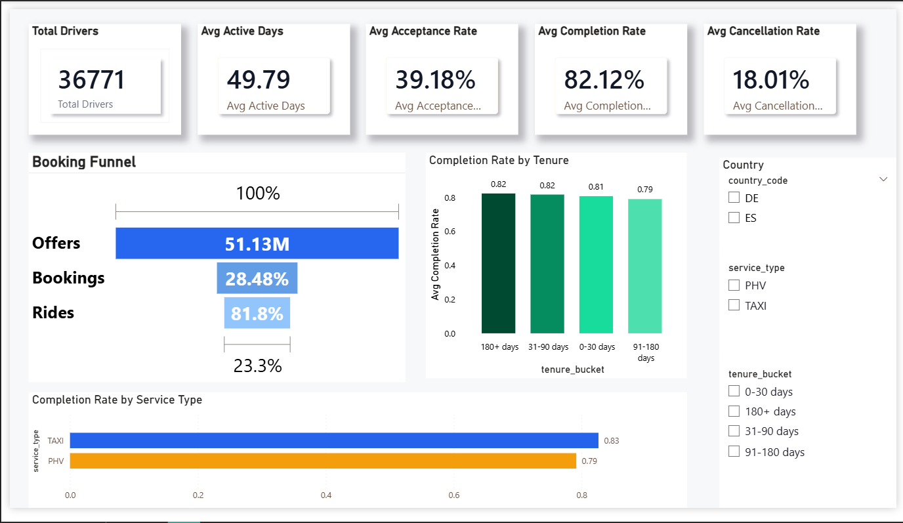

# Driver Engagement & Ride Performance Analytics

##  Project Overview
This project analyzes driver engagement and ride performance data for a ride-hailing platform using **SQL and Power BI**.  
The objective is to understand driver behavior, booking conversion, ride completion patterns, and performance variations across service types, tenure buckets, and countries.

---

##  Business Problems Addressed
- How many active drivers are on the platform?
- What percentage of bookings convert into completed rides?
- How does driver tenure impact completion rates?
- Which service type (Taxi vs PHV) performs better?
- Where are drivers dropping off in the booking funnel?

---

##  Dataset Overview
The dataset contains driver-level and ride-level metrics such as:
- Driver ID
- Country code
- Service type
- Total offers, bookings, and rides
- Acceptance, completion, and cancellation rates
- Driver tenure (in days and buckets)

---

##  Tools & Technologies
- **SQL** – Data cleaning, aggregation, KPI calculations
- **Power BI** – Dashboard creation and interactive analysis
- **Excel** – Initial data inspection

---

##  Data Cleaning & Preparation (SQL)
- Handled missing values using conditional logic (`CASE WHEN`)
- Removed invalid or zero-value records
- Created tenure buckets (0–30, 31–90, 91–180, 180+ days)
- Aggregated metrics using `GROUP BY`
- Calculated KPIs like acceptance rate, completion rate, and cancellation rate

---

##  Key Analysis & Insights
- Only ~23% of total offers convert into completed rides, indicating major funnel drop-offs.
- Drivers with **180+ days tenure** show the highest completion rates.
- Taxi service performs slightly better than PHV in ride completion.
- Higher acceptance rates directly correlate with higher completion rates.

---

##  Power BI Dashboard
The interactive dashboard includes:
- KPI cards for overall performance
- Booking funnel visualization
- Completion rate by tenure bucket
- Completion rate by service type
- Dynamic filters by country, service type, and tenure

### Dashboard Preview:

---

## 📂 Repository Structure
